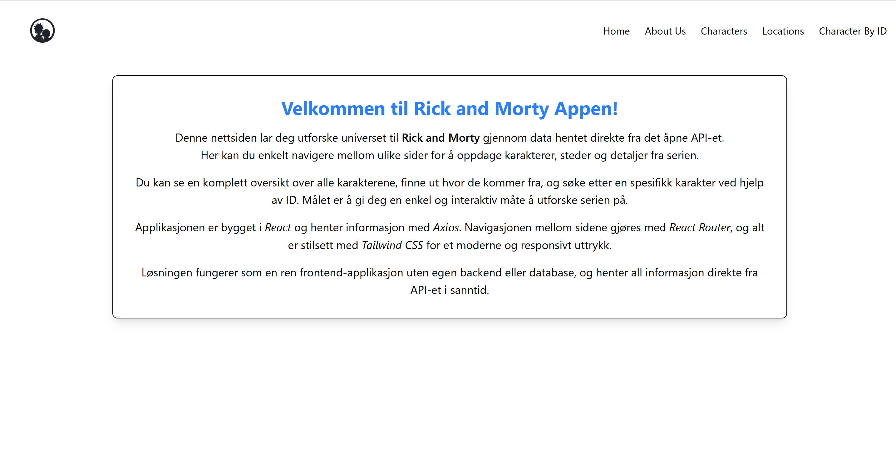
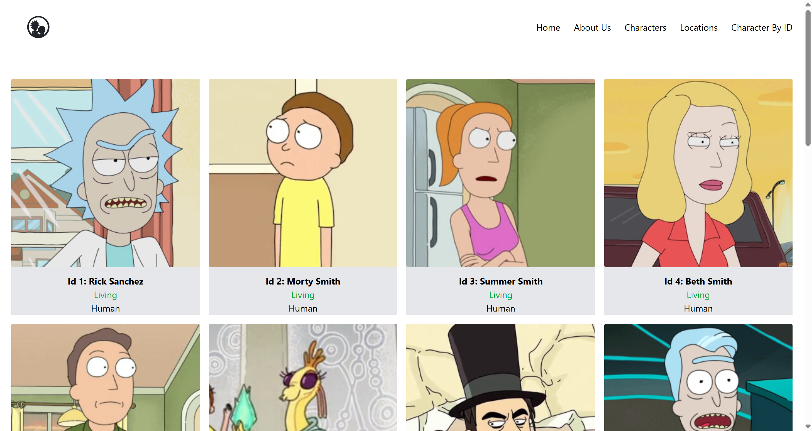
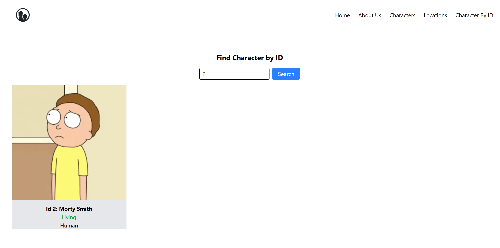
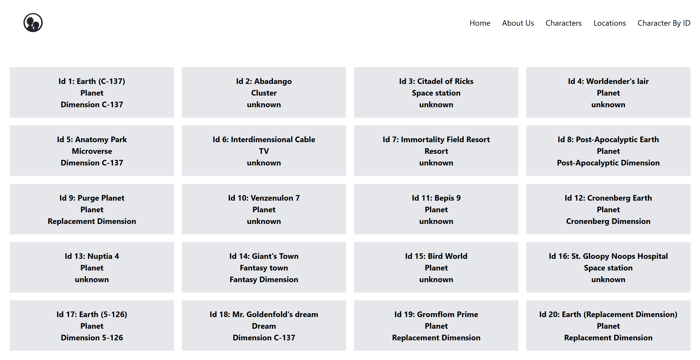
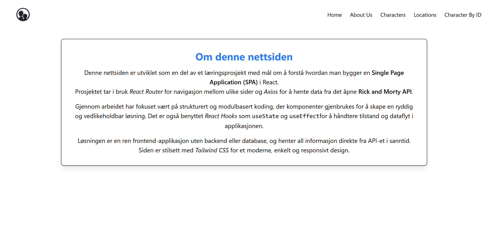

# Rick and Morty API App

En React-app som viser karakterer fra Rick and Morty-universet.  
Appen henter data fra det offentlige API-et og viser karakterer med søkefunksjon.

## 📸 Screenshots

### Hjemmeside

### Karakterliste

### Finn karakter etter ID

### Lokasjoner

### Om oss

## 🚀 Teknologier brukt
- ⚛️ **React** (med TypeScript)
- 🎨 **Tailwind CSS** for styling
- 🌐 **Axios / Fetch API** for datainnhenting
- ⚙️ **Vite** som utviklingsmiljø og bundler
